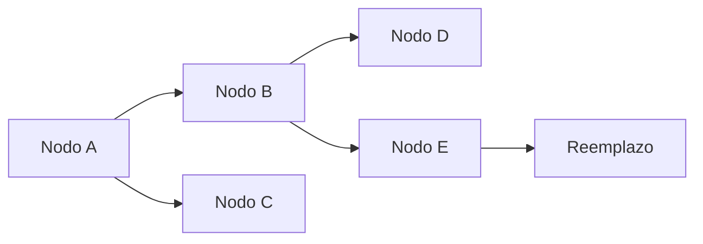
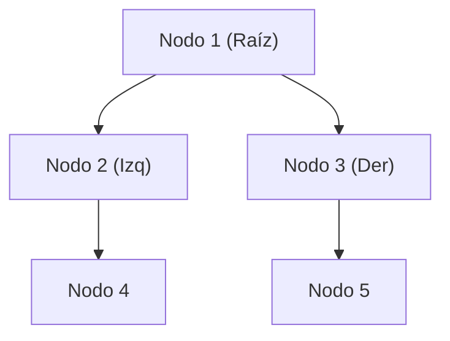
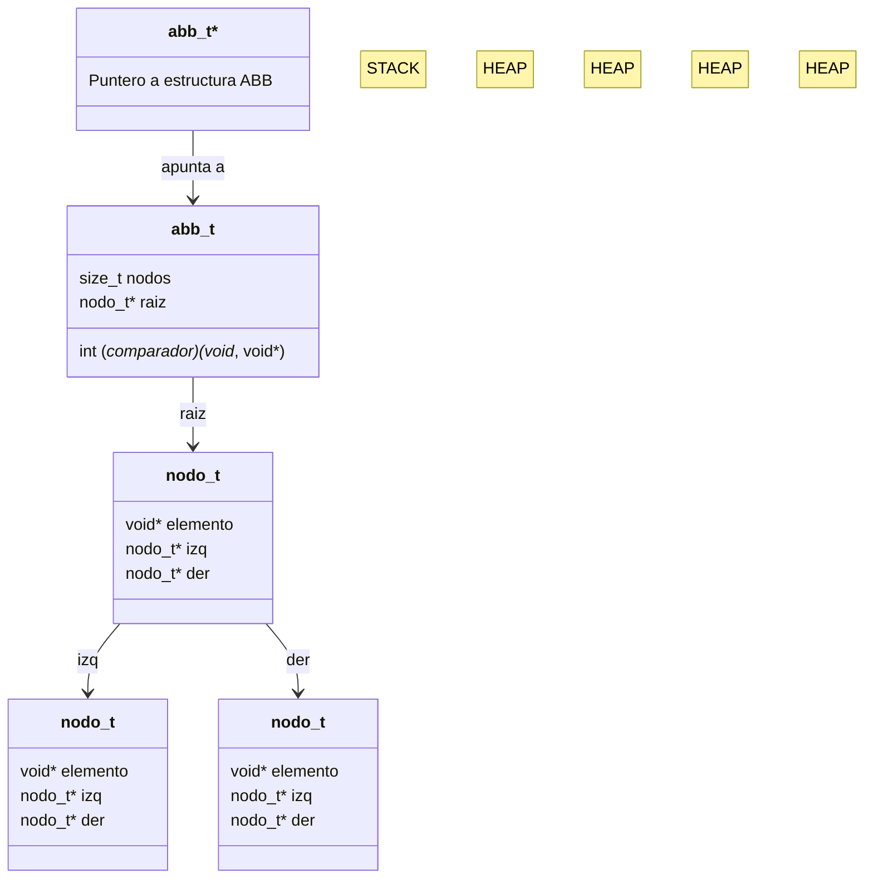

<div align="right">

</div>

# TDA ABB (Árbol Binario de Búsqueda)

## Alumno: (Nombre Apellido) - (Padrón) - (Mail)

### Para compilar:

```bash
make tp
```

### Para ejecutar:

```bash
./tp pokedex.csv
```

### Para ejecutar con valgrind:

```bash
valgrind ./tp pokedex.csv
```

---

## Funcionamiento

El Árbol Binario de Búsqueda (ABB) es una estructura de datos que permite almacenar elementos de forma ordenada. Cada nodo tiene un máximo de dos hijos: el izquierdo, que contiene elementos menores, y el derecho, con elementos mayores.

Se implementaron las siguientes operaciones sobre el ABB:

1. **Inserción (`abb_insertar`)**: Inserta un nuevo elemento en el árbol, respetando el orden definido por el comparador.
2. **Eliminación (`abb_quitar`)**: Elimina un elemento del árbol. Si el nodo tiene dos hijos, se reemplaza con su predecesor inorden.
3. **Búsqueda (`abb_obtener`)**: Encuentra y devuelve un elemento.
4. **Recorridos (`abb_iterar_inorden`, `abb_iterar_preorden`, `abb_iterar_postorden`)**: Recorren el ABB en los distintos órdenes.
5. **Destrucción (`abb_destruir` y `abb_destruir_todo`)**: Libera la memoria asociada al árbol y sus elementos si es necesario.

Se tomaron decisiones para garantizar eficiencia y evitar pérdida de memoria, por ejemplo, asegurando que `realloc` no cause pérdida de datos si falla, usando calloc para inicializar memoria en 0 y usando destructores personalizados para liberar memoria.

A continuación, se muestra un esquema básico de una posible configuracion del ABB:

```mermaid
graph TD;
    A[Raíz] --> B[B (Izq)]
    A --> C[C (Der)]
    B --> D[Hijo Izq de B]
    B --> E[Hijo Der de B]
    C --> F[Hijo Izq de C]
    C --> G[Hijo Der de C]
```

---

## Ejemplo de Código

El siguiente fragmento muestra cómo se implementó la función de inserción en el ABB (usando recursion y wrapper):

```c
bool abb_insertar(abb_t *abb, void* elemento) {
    if (abb == NULL || elemento == NULL)
        return false;

    size_t nodos_iniciales = abb->nodos;
    abb->raiz = nodo_insertar(abb, abb->raiz, elemento);

    return abb->nodos > nodos_iniciales;
}
```

En caso de eliminación, si el nodo tiene dos hijos, el árbol reemplaza el nodo con su predecesor inorden:



---

## Respuestas a las preguntas teóricas

### ¿Qué es un Árbol Binario de Búsqueda?

Un **árbol binario de búsqueda (ABB)** es un TDA en el que cada nodo contiene un valor y dos referencias a un par de hijos: uno hacia el subárbol izquierdo y otro hacia el subárbol derecho. Los valores en el subárbol izquierdo son menores que los del nodo actual, y los del subárbol derecho son mayores. Esto garantiza velocidades muy eficietes en los metodos del TDA

#### Complejidad de Operaciones

- **Inserción**: O(log n) en el mejor caso, O(n) en el peor caso.
- **Búsqueda**: O(log n) en el mejor caso, O(n) en el peor caso.
- **Eliminación**: O(log n) en el mejor caso, O(n) en el peor caso.

(El peor caso es cuando el arbol se ha degenerado en una lista)

#### Diagrama de Memoria

El siguiente es un ejemplo de cómo se almacenan los nodos del ABB en memoria:



### Decisiones de diseño

1. **Uso de funciones recursivas**: La mayor parte de las operaciones del ABB (inserción, eliminación, búsqueda) se implementaron de forma recursiva para simplificar el manejo de los punteros de cada nodo.

2. **Manejo de memoria**: Se empleó un destructor para liberar correctamente los elementos almacenados en el ABB cuando se destruye la estructura, ya que el ABB no conoce el tipo de los elementos.

---

## Diagrama de memoria detallado



En este diagrama se visualizan las relaciones entre nodos en el ABB, donde cada nodo apunta a sus hijos izquierdos y derechos.

---

## Conclusión

Este trabajo implementa un TDA Árbol Binario de Búsqueda eficiente y flexible, capaz de almacenar cualquier tipo de datos genéricos mediante el uso de un comparador. Se priorizó la claridad y eficiencia, asegurando una buena gestión de memoria y operaciones de tiempo logarítmico en la mayoría de los casos.
