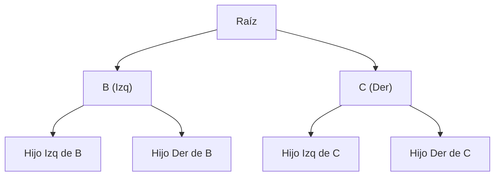
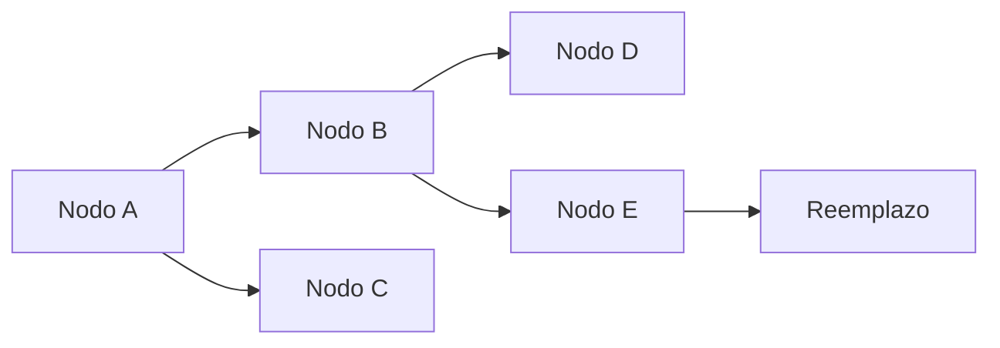
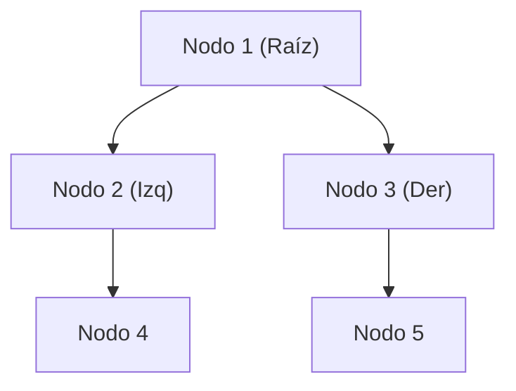
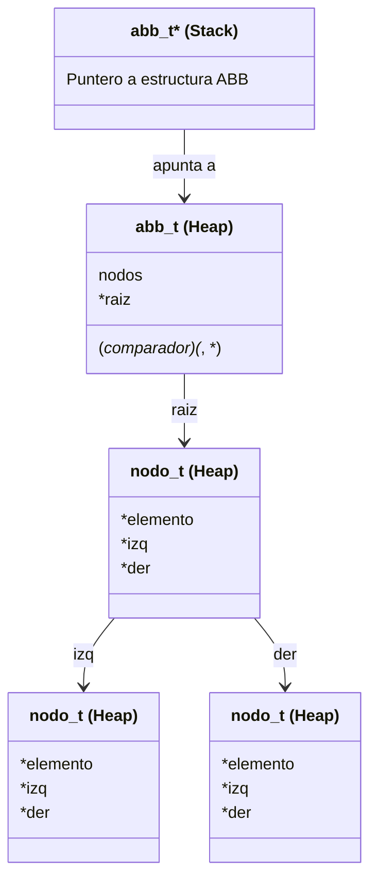

<div align="right">

</div>

# TDA ABB (Árbol Binario de Búsqueda)

## Alumno: (Nombre Apellido) - (Padrón) - (Mail)

### Para compilar:

```bash
make tp
```

### Para ejecutar:

```bash
./tp pokedex.csv
```

### Para ejecutar con valgrind:

```bash
valgrind ./tp pokedex.csv
```

---

## Funcionamiento

El Árbol Binario de Búsqueda (ABB) es una estructura de datos que permite almacenar elementos de forma ordenada. Cada nodo tiene un máximo de dos hijos: el izquierdo, que contiene elementos menores, y el derecho, con elementos mayores.

Se implementaron las siguientes operaciones sobre el ABB:

1. **Inserción (`abb_insertar`)**: Inserta un nuevo elemento en el árbol, respetando el orden definido por el comparador.
2. **Eliminación (`abb_quitar`)**: Elimina un elemento del árbol. Si el nodo tiene dos hijos, se reemplaza con su predecesor inorden.
3. **Búsqueda (`abb_obtener`)**: Encuentra y devuelve un elemento.
4. **Recorridos (`abb_iterar_inorden`, `abb_iterar_preorden`, `abb_iterar_postorden`)**: Recorren el ABB en los distintos órdenes.
5. **Destrucción (`abb_destruir` y `abb_destruir_todo`)**: Libera la memoria asociada al árbol y sus elementos si es necesario.

Se tomaron decisiones para garantizar eficiencia y evitar pérdida de memoria, por ejemplo, asegurando que `realloc` no cause pérdida de datos si falla, usando calloc para inicializar memoria en 0 y usando destructores personalizados para liberar memoria.

A continuación, se muestra un esquema básico de una posible configuracion del ABB:



---

## Ejemplo de Código

El siguiente fragmento muestra cómo se implementó la función de inserción en el ABB (usando recursion y wrapper):

```c
bool abb_insertar(abb_t *abb, void* elemento) {
    if (abb == NULL || elemento == NULL)
        return false;

    size_t nodos_iniciales = abb->nodos;
    abb->raiz = nodo_insertar(abb, abb->raiz, elemento);

    return abb->nodos > nodos_iniciales;
}
```

En caso de eliminación, si el nodo tiene dos hijos, el árbol reemplaza el nodo con su predecesor inorden:



---

## Respuestas a las preguntas teóricas
### Conceptos Básicos

#### 1. ¿Qué es un árbol?

Un **árbol** es una estructura de datos jerárquica que se compone de **nodos** conectados. El árbol tiene un nodo especial llamado **raíz**, que es el primer nodo con el que se empiezan a hacer conexiones con los **hijos** (otros nodos). Cada nodo puede tener múltiples hijos, pero sólo tiene un único padre (exceptuando la raiz que es la excepciòn a esta regla).

#### Propiedades de un Árbol:
- **Raíz**: Nodo principal.
- **Hojas**: Nodos que no tienen hijos.
- **Altura**: Número de aristas desde la raíz hasta el nodo más profundo.
- **Nivel**: Distancia de un nodo a la raíz.
- **Subárbol**: Cualquier nodo y todos sus descendientes.

#### Diagrama de un Árbol:
```
.      1 (Raíz)
      /  \
     2    3
    /    / \
   4    5   6
```

#### 2. ¿Qué es un Árbol Binario?

Un **árbol binario** es un tipo de árbol en el que cada nodo tiene como máximo **dos hijos**, usualmente con los nombres de **hijo izquierdo** e **hijo derecho**. Un árbol binario no impone ninguna restricción particular en los valores almacenados en los nodos usualmente, por lo que se les considerarian genericos.

#### Operaciones Básicas de un Árbol Binario:
- **Inserción**: Añadir un nodo en una posición especìfica.
- **Búsqueda**: Buscar un valor específico en el árbol.
- **Recorridos**: Preorden, inorden, postorden, para visitar todos los nodos del árbol.

#### Complejidad de Operaciones:
- **Inserción**: O(n) para mayoria de los casos.
- **Búsqueda**: O(n) para mayoria de los casos.
- **Recorridos**: O(n) para mayoria de los casos.

#### Diagrama de un Árbol Binario:
```
.      1
      / \
     2   3
    / \
   4   5
```

#### 3. ¿Qué es un Árbol Binario de Búsqueda (ABB)?

Un **árbol binario de búsqueda (ABB)** es un árbol binario con una propiedad especial: **cada nodo del subárbol izquierdo** contiene un valor **menor** que el nodo actual, y **cada nodo del subárbol derecho** contiene un valor **mayor** que el nodo actual.

#### Importancia del ABB:
Esta propiedad del ABB permite realizar búsquedas, inserciones y eliminaciones de manera eficiente, logrando una complejidad logarítmica en la mayoría de los casos, siempre cuando haya habido una inserciòn adecuado o se haya mantenido el arbol balanceado.

#### Diagrama de un ABB:
```
.      8
      / \
     3   10
    / \    \
   1   6    14
      / \   /
     4   7 13
```
En este ejemplo:
- El nodo con valor 8 tiene un subárbol izquierdo con valores menores que 8 (1, 3, 6, 4, 7).
- El subárbol derecho tiene valores mayores que 8 (10, 14, 13).

### Operaciones Básicas del ABB

1. **Inserción**: Se compara el valor a insertar con el nodo actual. Si es menor, se mueve al subárbol izquierdo; si es mayor, al derecho, y se continúa hasta encontrar una posición vacía.

   - **Mejor caso**: O(log n), cuando el árbol está balanceado.
   - **Peor caso**: O(n), cuando el árbol está degenerado (similar a una lista enlazada).

2. **Búsqueda**: Similar a la inserción. Se compara el valor buscado con el nodo actual y se mueve a la izquierda o derecha, dependiendo de si el valor es menor o mayor.

   - **Mejor caso**: O(log n).
   - **Peor caso**: O(n).

3. **Eliminación**: Se debe considerar tres casos:
   - El nodo a eliminar es una hoja (sin hijos).
   - El nodo a eliminar tiene un solo hijo.
   - El nodo a eliminar tiene dos hijos (en este caso, se reemplaza por el sucesor inorden, el valor mínimo del subárbol derecho o el máximo del subárbol izquierdo).

   - **Mejor caso**: O(log n).
   - **Peor caso**: O(n).

#### Diagrama de Eliminación:
Si eliminamos el nodo con valor 10 del árbol:
```
.      8
      / \
     3   13
    / \    \
   1   6    14
      / \
     4   7
```
El sucesor inorden de 10 (que es 13) lo reemplaza.

### Importancia de la Estructura y el Balanceo

Un árbol binario de búsqueda es útil para manejar datos de manera eficiente, pero si el árbol se desbalancea, sus ventajas desaparecen, ya que su complejidad puede degenerarse a O(n). Para evitar esto, se utilizan estructuras como los **árboles balanceados** (AVL o Red-Black trees), que garantizan que la altura del árbol se mantenga en log(n) y que el ABB no se degenere en lista, asegurando tiempos óptimos para operaciones comunes.

En resumen:
- **Árbol**: Una estructura básica con conexiones jerárquicas.
- **Árbol Binario**: Un árbol con a lo sumo dos hijos por nodo.
- **ABB**: Un árbol binario que garantiza que los nodos en la izquierda son menores y los de la derecha son mayores, mejorando la eficiencia en búsquedas e inserciones.

#### Diagrama de Memoria

El siguiente es un ejemplo de cómo se almacenan los nodos del ABB en memoria:



### Decisiones de diseño

1. **Uso de funciones recursivas**: La mayor parte de las operaciones del ABB (inserción, eliminación, búsqueda) se implementaron de forma recursiva para simplificar el manejo de los punteros de cada nodo, para mayor facilidad y legibilidad tambien se usaron funciones wrapper.

2. **Manejo de memoria**: Se empleó un destructor para liberar correctamente los elementos almacenados en el **ABB** cuando se destruye la estructura, dando opciones para liberar de forma simple o liberar tambien los elementos dando una funcion destructora, ya que el **ABB** no conoce el tipo de los elementos, es completamente agnostico a lo que guarda el usuario del **TDA**.

3. **Funcion Quitar**: Esta funcion fue de lejos la mas compleja de implementar, ya que se deben considerar 3 casos, el nodo a eliminar es una hoja, el nodo a eliminar tiene un solo hijo y el nodo a eliminar tiene dos hijos, en este ultimo caso se debe reemplazar el nodo a eliminar por el predecesor inorden.
Fue necesario implementar funciones auxiliares para algunos de los casos, como la funcion **nodo_quitar_hoja**, etc. Además, de crear una funcion auxiliar para encontrar el predecesor inorden.

---

## Diagrama de memoria detallado



En este diagrama se visualizan las relaciones entre nodos en el **ABB**, donde cada nodo apunta a sus hijos izquierdos y derechos.

---

## Conclusión

Este trabajo implementa un TDA Árbol Binario de Búsqueda eficiente y flexible, capaz de almacenar cualquier tipo de datos genéricos mediante el uso de un comparador. Se priorizó la claridad y eficiencia, asegurando una buena gestión de memoria y operaciones de tiempo logarítmico en la mayoría de los casos.
